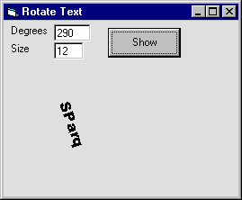



## FINALLY\! A Way To Freely Rotate Text\.

### Description

Rotate Text to any Angle!!!

EASY!!
 
### More Info
 

             |
---                |---
**Submitted On**   |2000-07-31 13:37:18
**By**             |[Sparq](https://github.com/Planet-Source-Code/PSCIndex/blob/master/ByAuthor/sparq.md)
**Level**          |Intermediate
**User Rating**    |4.7 (28 globes from 6 users)
**Compatibility**  |VB 5\.0, VB 6\.0
**Category**       |[Custom Controls/ Forms/  Menus](https://github.com/Planet-Source-Code/PSCIndex/blob/master/ByCategory/custom-controls-forms-menus__1-4.md)
**World**          |[Visual Basic](https://github.com/Planet-Source-Code/PSCIndex/blob/master/ByWorld/visual-basic.md)
**Archive File**   |[CODE\_UPLOAD84357312000\.zip](https://github.com/Planet-Source-Code/sparq-finally-a-way-to-freely-rotate-text__1-10250/archive/master.zip)

